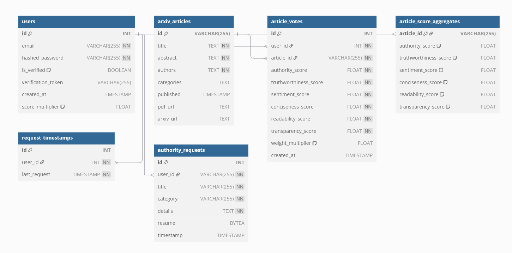

# Introduction

SciVote is a search engine built on top of the ArXiv open-access
repository of preprints. In addition to vector-based search, SciVote
enables users to dynamically re-rank results based on community-voted
criteria, offering a more tailored and transparent discovery experience.
The platform encourages continuous evaluation of sources, allowing all
registered users to submit votes. Qualified users can request elevated
authority by proving expertise to balance openness with credibility.

# The Value of Building on ArXiv

ArXiv is a key platform in the scientific community, offering free
access to an extensive collection of preprints in fields like physics,
mathematics, and computer science. By allowing researchers to share
their work before formal peer review, ArXiv helps spread new ideas
quickly. Its openness ensures that research is available to everyone,
without expensive subscriptions, encouraging a more transparent and
collaborative scientific process. Unlike Google Scholar, which focuses
on publications and citation counts, SciVote uses ArXiv's openness to
create a more interactive experience. Instead of just looking at
citations, SciVote lets users rank papers based on community-driven,
peer-voted criteria.

SciVote aims to change how research is evaluated. Traditional systems
rely on citation counts and publication prestige, but SciVote introduces
a more dynamic, community-based approach. Allowing users to rank papers
based on peer-voted criteria creates a real-time, collaborative way to
assess research quality. This approach makes the evaluation process more
transparent, as the broader community contributes, not just a select
group of experts. Additionally, SciVote helps bridge the gap in
open-source research evaluation by offering an inclusive platform where
quality is measured beyond traditional metrics. This ensures that the
most relevant and impactful work is easier to discover.

# SciVote Functionalities

## Implemented features

-   **Login / Register**

-   **Adding a Source via ArXiv ID**

-   **Authority Requests**

-   **Vector Search**

    -   Filter the number of results

    -   Filter by categories

-   **Dynamic Search Ranking**

    -   Base score weight

    -   Weighting from -1 to +1:

        -   Normalized Recency

        -   Normalized peer-voted scores

-   **Search Result Consultation**

    -   Links to PDF, ArXiv

    -   Abstract, title, authors, published year, categories

-   **Article Voting** (Based on peer-voted criteria)

## API Endpoints

Source addition and search operations are handled via API endpoints.
CORS restrictions apply, though additional traffic sources can be
configured through environment variables.

### \[POST\] /api/search/

**Returns** a list of articles inside a JSON object. The present: arxiv
identifier, abstract, title, and base scores. Moreover, normalized
recency, authority, trustworthiness, sentiment, conciseness,
readability, and transparency scores are returned for each article.\
**Parameters:** Query, category, top k.

### \[GET\] /api/add/<arxiv_id>

**Returns** whether or not the article has been added into the system.\
**Parameter:** arxiv identifier with or without versions and \"arxiv\"
prefix, as these are filtered automatically.

## Unimplemented

To avoid excessive load on the ArXiv API and due to memory constraints
of vector storage, automatic indexing was not implemented for this proof
of concept. However, external scripts may batch-index articles via the
`/api/add/<arxiv_id>` endpoint. This is not critical, and user
submission may, in turn, make the platform more relevant, as this would
prevent too many articles from having zero votes.

# Technical Details

## SQL Database

SciVote uses MariaDB to store structured data. It's a common and
reliable SQL database that works well for read-heavy applications,
making it an ideal choice for managing large amounts of article metadata
and user interactions. With minimal write operations, MariaDB can scale
effectively to handle millions of articles and users. However, switching
to PostgreSQL could be beneficial if the project were to mature.
PostgreSQL offers greater scalability and advanced functionalities, such
as materialized views (for score aggregation, rather than within the
code) and better constraint enforcement using triggers and procedures.\
For prototyping, keeping the logic within the code was more appropriate.
Strongly enforced database schemas often make assumptions about data
structure and relationships that may not yet align with users needs and
feedback. This approach allows for more flexibility as the project's
requirements are still being defined.\
The SQL has the following schemas:

::: center

:::

In the `arxiv_articles` table, category search is performed within the
vector database, and categories or author lists are displayed for user
convenience as comma-separated values. Given the current use case, we
can consider the database in **Third Normal Form (3NF)**. However, if
category or author search were to be performed at the SQL level, the
table would need further normalization. Specifically, this would involve
creating relationships such as an `ArticleCategory` table (`article_id`,
`category_id`), a `Category` table (`category_id`, `category`), an
`Author` table (`author_id`, `author`), and an `ArticleAuthor` table
(`author_id`, `article_id`) to manage many-to-many relationships.
Though, as the database score is used for score and metadata retrieval,
it felt more relevant to store the output directly and defer the
filtration to the vector database.

While `article_vote` keeps track of user votes alongside their authority
level at the time of voting, `article_vote_aggregate` is dynamically
updated within the code, adding or subtracting from each subscore. This
prevents the need for LEFT JOINs on every search result for each search
request. If the system switched to PostgreSQL, the
`article_vote_aggregate` would move from the code to a materialized
view, with associated triggers for refreshing the data. Keeping both
tables is essential because the `article_vote` table can always be used
to fully recompute `article_vote_aggregate` at any given time.

## Web-Server

I chose FastAPI for SciVote because it's a fast, easy-to-use Python
framework that enables quick API development with excellent performance.
Since I'm already comfortable with Python, FastAPI allows me to build
and deploy APIs efficiently, while supporting asynchronous requests for
handling multiple users simultaneously. Gunicorn and Uvicorn. Gunicorn
efficiently distributes requests across various workers, making it ideal
for handling general traffic but less suited for highly asynchronous
applications. On the other hand, Uvicorn, as an ASGI server, excels at
handling asynchronous tasks like I/O operations. This combination allows
SciVote to manage synchronous and asynchronous requests effectively,
maximizing its availability and responsiveness, especially given the
system's limited resources.

### Application Structure

`app/` - Root directory containing the application entry points,
including routing for `/`, error handlers, and the fallback route.

`app/db/` - Handles all database-related functionality:

-   **`database`**: Retrieves and manages the database instance.

-   **`request`**: Contains all database query functions.

`app/models/` - Defines core data models used throughout the
application:

-   **`arxiv_documents`**: Represents ArXiv documents, including PDF
    extraction logic.

-   **`search_request`**: Defines the POST body parameters for the
    `/search/` endpoint.

`app/routes/` - Contains route definitions and their associated
controllers:

-   **`api/`**

    -   `add`: Controller for adding sources.

    -   `search`: Controller for handling search endpoint requests.

-   `auth`: Handles user authentication (Register, Login, Logout).

-   `authority`: Manages the authority request page.

-   `grade`: Controller for the article grading page.

-   `view`: Controller for viewing search results.

`app/services/` - Implements service logic and external integrations:

-   `arxiv_api`: Manages web requests to the ArXiv API.

-   `auth`: Implements authentication logic.

-   `utils`: Provides utility functions used across the application.

-   `vector_search`: Encapsulates logic for vector-based database
    search.

`app/static/` - Contains static files.

`app/templates/` Holds HTML templates (Jinja2) used for server-side
rendering.

## Vector Database

Elasticsearch is used for the initial search in SciVote. It's an
open-source search engine ideal for vector and text-based searches
across extensive document collections. Indexing ArXiv papers' vector
representations and metadata provides highly relevant search results.
However, its high memory consumption is a key challenge, and my decision
to use it was primarily driven by a desire to learn this technology.
Prompting ChatGPT for a rough conservative estimate, indexing the 2.4
million articles would require 8GB of RAM dedicated to ElasticSearch.

### Document Insertion

When inserting a document into the database, the following information
is stored:

-   Publication Date

-   Title

-   Content Keywords (extracted using SpaCy and TextRank)

-   Abstract

-   Abstract Keywords (also extracted with SpaCy and TextRank)

-   Vector Representation of the content using `all-MiniLM-L6-v2`

-   Categories

The index is refreshed every 30 seconds, meaning it can take up to 30
seconds to appear.

### Document Retrieval

When retrieving documents from the Elasticsearch index, the system uses
a hybrid search combining:

-   **Text-Based Search**:

    -   Boosted matches on:

        -   Title (`boost: 2.0`)

        -   Abstract (`boost: 1.5`)

        -   Abstract keywords (`boost: 2.0`)

        -   Content keywords (`boost: 1.0`)

-   **Category Filtering**:

    -   If category filter, boolean condition.

-   **Vector Similarity**:

    -   k-NN search on embeddings by the query

    -   Rank top-k result by cosine-distance

## Raw Scores vs Search Scores

Each vote on the peer-voted criteria (Authority, Trustworthiness,
Neutrality, Conciseness, Readability, Transparency) adds or subtracts
from the subscores. These votes are then multiplied by the user's
authority weight, ensuring that more knowledgeable users significantly
influence the results. As a result, raw scores can take any value along
the real axis. These raw scores are then normalized using the sigmoid
function when retrieved for searching, ensuring a consistent and
balanced ranking. The final score is calculated client-side through a
linear combination of the subscores and their associated weights,
reflecting user preferences in real-time.

## Caching Strategy

SciVote uses in-memory TTL caching to improve performance and manage
rate limits across key operations. This is especially important for
search, where frequently retrieved articles do not need their scores
recomputed on every API call. Similarly, article metadata remains static
for the project's current scope, making it efficient to cache. **Note:**
This trade-off improves availability but may defer the visibility of
score updates or new results until the cache expires.

### Search Caches

-   `SEARCH_CACHE`: Stores recent search queries\
    **Max size:** 500 entries\
    **TTL:** 60 seconds

-   `ARTICLE_CACHE`: Caches metadata for articles\
    **Max size:** 1000 entries\
    **TTL:** 30 days (2,592,000 seconds)

-   `SCORE_CACHE`: Temporarily stores computed score results\
    **Max size:** 1000 entries\
    **TTL:** 60 seconds

-   `RATE_LIMIT_CACHE`: Enforces per-user rate limits for search\
    **Max size:** 1000 entries\
    **TTL:** 60 seconds

### Add Caches

-   `RATE_LIMIT`: Maximum of 5 additions per 60 seconds

-   `RATE_LIMIT_CACHE`: Enforces rate limiting for add operations\
    **Max size:** 1000 entries\
    **TTL:** 60 seconds

-   `ANSWER_CACHE`: Stores responses to recent add requests\
    **Max size:** 500 entries\
    **TTL:** 24 hours (86,400 seconds)

## Docker

Deploying each service individually can be time-consuming, but Docker
simplifies this by packaging each service with its dependencies,
allowing for a seamless, single-command setup.

For enhanced security, volumes are set to read-only where possible.
Elasticsearch and MariaDB are isolated within an internal network, while
FastAPI is exposed for external access. Sensitive data, including
passwords and tokens, is securely loaded from a `.env` file. Finally,
the VM root user and the default MariaDB permissions are deleted to
prevent data loss from a potential SQL injection, further strengthening
security.

### Deployment Build

Resource usage is capped at 4GB of RAM to ensure efficient operation.
FastAPI runs with two workers on a lightweight Python 3.11-slim image,
optimizing performance by removing unnecessary components. Resource
allocation is as follows: FastAPI receives two vCPUs and 1.25GB of RAM,
Elasticsearch is assigned one vCPU and 1.3GB of RAM, and MariaDB is
allocated one vCPU and 0.95GB of RAM. This configuration is guided by
OVH Cloud pricing, with deployment planned on a VPS offering 4GB of RAM
and four vCPUs at a monthly cost of \$14 (paid for a single month only).
The memory ceiling constrains the number of FastAPI workers, and system
overhead must also be considered. Additionally, Python 3.11 is the
latest version available for Debian 12, which justified the version
choice.

### Local Build

Python 12 is also compatible with the project. No other version has been
tested, though it should run with any more recent versions. Running
locally, you are free to remove memory constraints.

# Running the Project On Your Machine

## System Requirements (Recommended)

-   **RAM**: 4GB of available RAM (recommended).

-   **CPU**: 4-core CPU.

-   **Disk Space**: At least 10GB of free disk space.

-   **Operating System**: Tested on Windows 11 but should run anywhere.

-   **Network Access**: Ports `8000`, `9200`, and `3306` are available
    and not blocked

-   **Docker**: Docker and Docker Compose must be installed.

## Environment variables

Create a `.env` file in the root of your project with the following
content:

    MYSQL_ROOT_PASSWORD=rootpassword
    MYSQL_DATABASE=rate_my_arxiv
    MYSQL_USER=application
    MYSQL_PASSWORD=lolthisisnotastrongpassword
    DB_HOST=mariadb
    CORS_ALLOWED_ORIGINS=http://localhost:8000

You are free to change the passwords or add to the CORS origins.

## Build and run

Run the following command:

    docker-compose up --build

# Acknowledgments

I should note that the project was developed swiftly with the assistance
of ChatGPT. Moreover, I should thank arXiv for using its open-access
interoperability.
